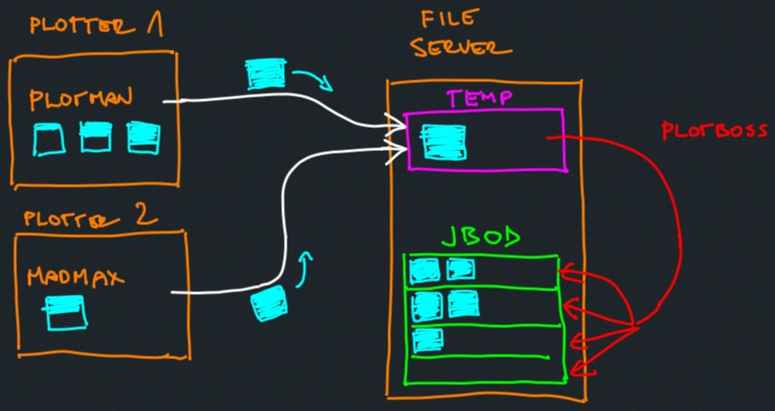

# plotboss

## About

Plotboss is a node.js utility for auto moving chia finished plots from a centralized temporary drive(s)  to a final array of destination disks (optimally, in a JBOD setup)

*OS support: This application supports unix systems and will not work on windows.*

*We recommend using it in combination with [plotman](https://github.com/ericaltendorf/plotman)* or [madmax](https://github.com/madMAx43v3r/chia-plotter). Plotman/Madmax destination drives are temp drives of plotboss.

Typical hardware setup this app is intended for:
- server with a temporary drive for incoming finished plots and a JBOD
- several independent nodes (PCs) acting as plotters with the same temporary destination drive residing on a network server that also exposes disks in a JBOD fashion (this server runs plotboss)



TODO: Add support for automatic recognition filesystem format and mounting of newly added disks.

# Functionality

- automatically detects plots from the list of specified temp folders (ignores .tmp files and entries in the ignore section of the config file)
- automatically load balances moving of plots to destinations (individual disks)
- automatically removes full destinations from destination list
- throttles move operations to one per destination
- allows on fly the config changes while running (watch out for auto-save function in your editor, it may save an invalid state and crash the app)

# Install and run

make sure you have node.js > 14.0 (to support module level async await).

```
git clone https://github.com/u2ros/plotboss.git
cd plotman
npm install
```

To get some feeling how the app works, run the test setup script:

`./test_setup.sh`

This will create a directory called test, inside it, 2 temp and 3 dest directories. A bunch of 0.35Mb dummy plot files will also be created in both temp directories. Dest folders will be changed to 1Mb ramdisks to simulate the behavior of the app. Each ramdisk will hold max 2 350kb files, once the plot count reaches 2, that destination will be removed from desination drives in the config.

A default config file will also be created, which you can modify to your needs. (yours will look slightly different depending on where you cloned the repo)

```
temps:                             #list of temporary folders, at least one
  - /home/dev/plotboss/test/temp1
  - /home/dev/plotboss/test/temp2
ignore:                            #these names will be ignored, no pattern matching here, just literals
  - lost+found
  - thumbs.db
destinations:                      #list of destination folders, probably as many as you have disks
  - /home/dev/plotboss/test/dest1
  - /home/dev/plotboss/test/dest2
  - /home/dev/plotboss/test/dest3
delays:
  disks: 5                         #interval for check disks function (seconds)
  plots: 5                         #interval for checking for ne plots on temp paths
  move: 5                          #stagger for moving plots from temp to dest
queue:
  limit: 8                         #maximum number of concurrent moves
```

After modifying your config.yaml file (or leave it as it is for the test run), start the tool with:

`node plotboss.mjs`

After testing, remove the mounts and test dir by running:

`./test_cleanup.sh`

This will retain the config.yaml file which you can then modify for actual use
